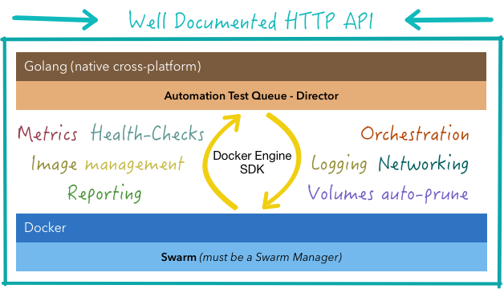

# Automation Test Queue (ATQ): Director

<<<<<<< HEAD
[](http://ec2-35-177-127-126.eu-west-2.compute.amazonaws.com:8080/job/ATQ/job/develop/)
=======
[](http://atq.mtenrero.com:8080/job/ATQ/job/master/)
>>>>>>> release/preview1
[](https://coveralls.io/github/mtenrero/ATQ-Director)
[](https://editor2.swagger.io/?url=https://raw.githubusercontent.com/mtenrero/ATQ-Director/master/swagger/swagger.yaml)

Automation Test Queue is a server-side binary which exposes a HTTP API and communicates with the Docker subsystem.

It's designed to work alongside a Docker Swarm cluster creating a short-lived distributed services on demand in the cluster with their own virtual network.

This ease the testing stage in CI/CD scenarios, allowing to run tests in a public/private/hybrid cloud without taking care of the infrastructure. The only configuration needed is an already working Docker Swarm and desired Docker Images. 

It's developed in Golang and cross-compiled, so it's compatible natively with al OSes (Linux, OSX and Windows) and works with both container types: Windows & Linux with minimum host resource consumption.




## Versioning

ATQ will not broke your code upgrading the Release version cause all major changes to the API will be developed in
a brand new version endpoint.

The initial version starts with `v1` tag: `https:\\host:port\v1\...`.
And the following versions will be `https:\\host:port\v2...`

## Configuration

You can specify which images are available to use with ATQ for security reasons with a YAML configuration file with the following structure:

```yaml
port: 9050
images:
  - imageName: mtenrero/jmeter
    args:
      - name: MODE
        required: true
      - name: TEST_NAME
        required: false
      - name: REMOTES
        required: false
``` 

All images specified in this file will be pulled from the registries to make them available instantly when requested, so starting time may be increased in the first launch.

### **Images**

Images contain a list with the enabled images available to use with ATQ-Director

Available fields:

* **imageName**: Docker Image identifier (Docker Hub / Private Registry)
* **Args**: Available arguments

## API

In order to maintain an up-to-date API documentation, please, check the Swagger API generated docs available inside the **swagger** folder in this repository

## How to use this repository

I've used **dep** for vendor handling. So make sure tu do a `dep ensure` before start to code.

### Goa Design

HTTP API were designed at the beggining of the project. Goa Design Framework was used to define the API, it has its own DSL and its available in the _http/design_ package.

After a design modification it's neccesary to run the script `./regenerateGoa.ps1` or `./regenerateGoa.sh` (depending OS) in order to regenerate all files taking care of the _vendoring_ directory, which causes issues with _goagen_

If needed, check goa documentation: [https://goa.design](https://goa.design)

## Testing & Good practices

All commits should improve the test coverage and any commit that couldn't pass the tests will not be merged in the master branch.

Master branch is stable. All improvements or fixes should be done in the golang-dev branch or inside a specific branch.

Any feature should be well documented and tested. 

Godocs compatible code must be used.

## Disclaimer

**THIS IS AN INITIAL VERSION AND IT'S NOT COMPLETE !!**

_Guarantee it's not provided, use at your own risk._
